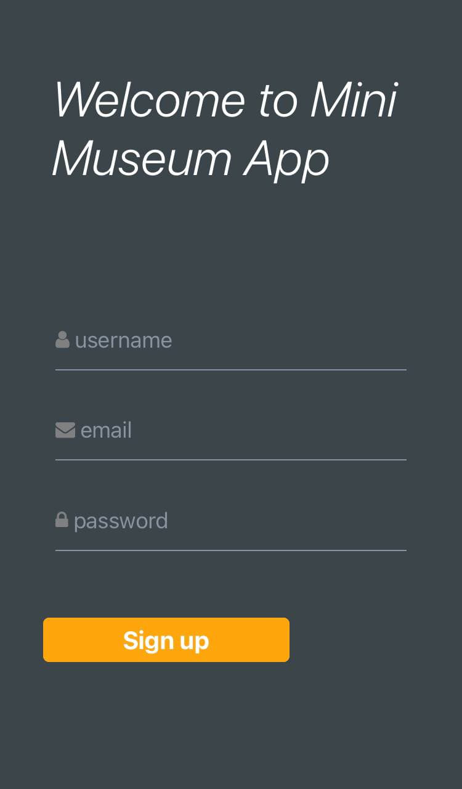
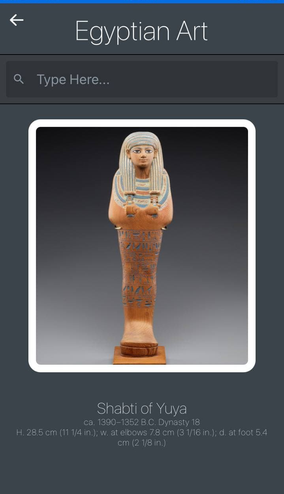
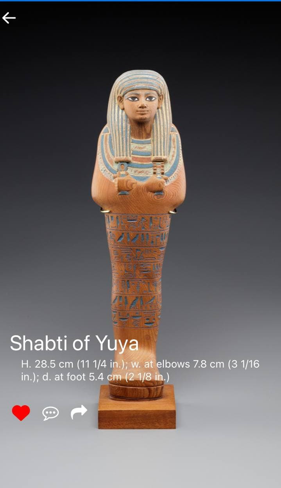

# mini-museum-app
In this project, the tehnology is using with expo, react native, react native element and shared element transition.
User authentication is handle by the firebase email authentication, all the users information is storing into clould firestore
The app navigation is using react navigation handle the route and navigate/ redirect to different stack screen.
This app is using open ApI from The Metropolitan Museum of Art Collection API(https://metmuseum.github.io), there are no pagnition available in the ApI, loading the data will take sometimes
Using the React's useState hook to maintain two different gallery list state and the useEffect hook to call the fetch their own API.
This project will continue develop with test can build CI/CD github action.

